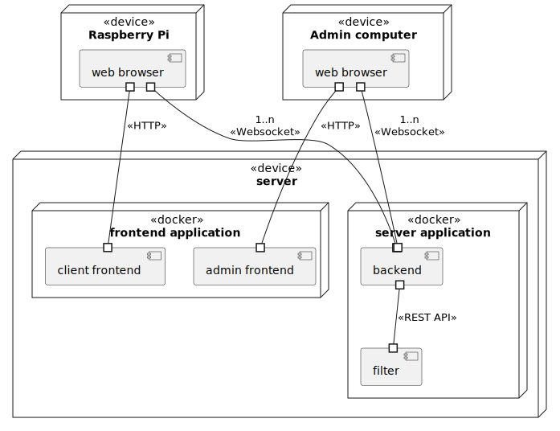

# Implementation principle of the solution (how)

<!-- en dessous le code plantuml pour générer le diagrame de déploiement -->

<!--
```plantuml deployment
@startuml
node "server" <<device>> as srv {
  node "server application" <<docker compose>> as cmp {
    component "backend" <<docker>> as bck
    component "client frontend" <<docker>> as cfr 
    component "admin frontend" <<docker>> as afr
  }
}

node "Raspberry Pi" <<device>> as rpi

cloud "Social Network API" as api

cloud "Learning Behavior API" as lbr

srv --(0 api: <<REST API>> "1..n"
srv -(0 lbr: <<REST API>>
srv 0)-- rpi: <<HTTP>> "1..n"
bck #--# afr: <<Socket.IO>>
bck #-# cfr: <<Socket.IO>>
@enduml
``` 
-->

# Architecture rules
# Static model : packages organization, main classes descriptions and their responsabilities

## Server Backend
```mermaid
classDiagram


class App {
  -List~Post~ cache
  -List~API~ apis

  +App()
  +addAPI(API api)
  +removeAPI(API api)
  +addPost(Post post)
  +removePost(int id)
}

class Filter {
  +filter() List~Post~
  -filterByBlacklist() List~Post~
  -filterByWhitelist() List~Post~
  -filterByDate() List~Post~
  -filterByNegativeEmotion() List~Post~
  -removeImages() List~Post~
  -removeVideos() List~Post~
}

class SocketServer {
  +SocketServer()
  +onConnect()
  +onDisconnect()
  +onNewPost()
  +onNewConfig()
  +sendPost(Post post)
  +sendConfig(Config config)
}

class Config {
  -int numberOfScreens
  -int dateRange
  -List~String~ forbiddenWords
  -List~String~ whiteListAuthors
  -List~String~ whiteListHashtags
  -bool allowSound
  -bool allowVideo
  -bool allowImage

  -writeConfigToFile(String nameFile) Boolean
  -readConfigFromFile(String nameFile) Boolean
  +save() Boolean
  +getInstance() Config
  +toString() String
}

class Post {
  -int id
  -String content
  -String author
  -Date date
  -String url
  +Post(String content, String author, Date date, String url, PostImage image, SocialNetwork source)
  +Post(String content, String author, Date date, String url, SocialNetwork source)
  -getUniqueID() int
  +toString() String
}

class API {
  <<abstract>>
  -String base_url
  -String api_key
  -List~String~ hashTag$
  +API(String base_url)*
  +searchPostFromHashtag()* Post
  +defineHashTag(String hashtag)$
}

class PostImage {
  -String url
  +PostImage(String url)
  +getURL()
}

class SocialNetwork {
  <<enum>>
  TWITTER
  INSTAGRAM
  FACEBOOK
  LINKEDIN
}

class TwitterAPI {
  
}

class LinkedInAPI {
  
}

class InstagramAPI {
  
}

class FacebookAPI {
   
}

App "1" --o "1" Filter
App "1" --o "1" SocketServer
App "1" --o "1" API
Filter "1" --> "1" Config : config
Filter "1" --> "*" Post : postsFiltered
Post "*" --> "0..1" PostImage : image
Post "1" --> "1" SocialNetwork : source
Config "1" --> "0..*" SocialNetwork : socialNetworkAccepted
SocketServer "1" --> "1" Config : config
API "1" --> "1" Config : config
API <|-- TwitterAPI
API <|-- LinkedInAPI
API <|-- InstagramAPI
API <|-- FacebookAPI


```

## Frontend Clients

```mermaid
classDiagram
class App {
  -Boolean isConnected
  -Post currentPost
  -Post previousPost
  -onConnect()
  -onDisconnect()
  -onMount()
  -onUnmount()
  -onNewPost()
}
```

## Frontend Administration

```mermaid
classDiagram
class App {
  -Boolean isConnected
  -Config config
  -onConnect()
  -onDisconnect()
  -onMount()
  -onUnmount()
  -onChangeConfig()
}
```

# Dynamic model : events streams, nominal and error-related, startup and shutdown
# Explaination about analysis constrains consideration
# Production frame : development, configuration and deployment tools.

## Development tools

- Git / GitHub
- CI

DEVELOPMENT RULES :
- Naming conventions : [makecode.com/extensions/naming-conventions](https://makecode.com/extensions/naming-conventions)

## Configuration tools

## Deployment tools

- Docker 
